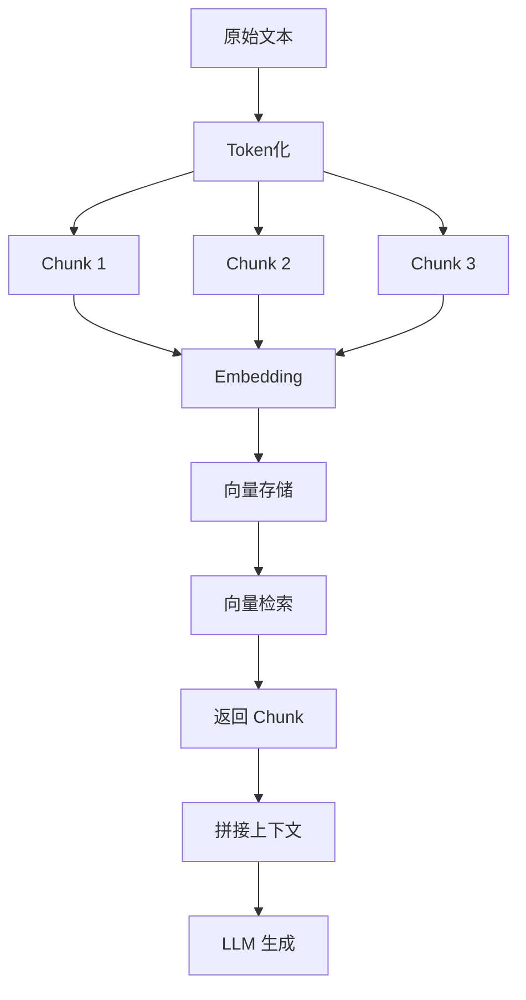
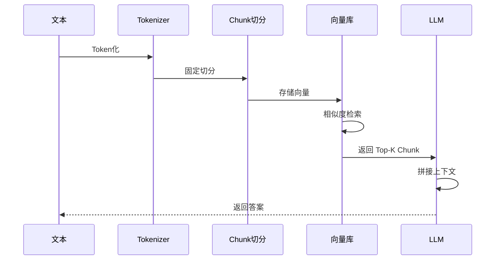

# 固定 Token 切片策略（RAG 实践）

## 1. 背景

在 RAG 系统中，最基础、也是使用最广泛的一种切片方式是：

> 固定长度切片（Fixed Token Chunking）

这种方式广泛存在于：

- OpenAI Embedding Pipeline
- 各类向量数据库默认实现
- LangChain / LlamaIndex 初始策略

---

### 为什么会有这种方式？

因为大模型存在一个硬限制：

> **Token 上限（Context Window）**

如果不控制长度，会出现：

- 超出模型输入限制
- embedding 不稳定
- 检索结果不可控

---

## 2. 设计思路

核心思想非常直接：

> 按固定 Token 数量切分文本

---

### 切分规则

- 每个 chunk 长度固定
- chunk 之间允许 overlap
- 不考虑语义，仅保证长度

---

### ✅ 核心原则

> 用“长度”保证稳定性，而不是“语义”

---

## 3. 架构图（核心）



---

### 🔍 图解说明

#### Step 1：Token 化

```
文本 → Token
```

- 使用 tokenizer（如 tiktoken）
- 转换为模型可处理单位

---

#### Step 2：固定切片

```
Token → 固定长度 chunk
```

例如：

```
chunk_size = 300
overlap = 50
```

切分为：

```
[1-300]
[250-550]
[500-800]
```

---

#### Step 3：向量化 & 检索

- 每个 chunk 单独 embedding
- 存入向量数据库
- 检索返回 Top-K chunk

---

## 4. 执行流程（动态）



---

### 🔍 流程拆解

#### 离线阶段

- 文本 → Token
- Token → Chunk
- Chunk → Embedding → Vector DB

---

#### 在线阶段

1. 用户提问
2. embedding 查询
3. 返回 chunk
4. 拼接上下文
5. LLM 生成答案

---

## 5. 核心实现

### 5.1 依赖

```bash
pip install tiktoken
```

---

### 5.2 Token 切片实现
# 项目文件:core/chunking/fixed_token.py
```python
import tiktoken
from typing import List


class TokenChunker:

    def __init__(
        self,
        model_name="gpt-4o-mini",
        chunk_size=300,
        overlap=50
    ):
        self.encoding = tiktoken.encoding_for_model(model_name)
        self.chunk_size = chunk_size
        self.overlap = overlap

    def chunk(self, text: str) -> List[str]:
        tokens = self.encoding.encode(text)

        chunks = []
        start = 0

        while start < len(tokens):
            end = start + self.chunk_size
            chunk_tokens = tokens[start:end]

            chunk_text = self.encoding.decode(chunk_tokens)
            chunks.append(chunk_text)

            start += self.chunk_size - self.overlap

        return chunks
```

---

## 6. 切片示意

```
Token序列：

[1 2 3 4 5 6 7 8 9 10 ...]

chunk_size = 5
overlap = 2

切分结果：

[1 2 3 4 5]
      [4 5 6 7 8]
            [7 8 9 10]
```

---

### 🔑 关键点

- overlap 防止语义断裂
- chunk_size 控制 token 长度
- 不关心语义结构

---

## 7. 为什么大厂一定用它？

### OpenAI

- embedding API 强依赖 token 长度
- 推荐 chunk size 控制在合理范围

---

### Google

- 在大规模索引中优先使用“规则切分”
- 保证系统稳定性

---

### Anthropic

- 强调 token 管理（context window）
- 控制输入规模

---

👉 本质原因：

> **Token 是模型真正理解的单位**

---

## 8. 参数设计（经验）

| 参数 | 建议值 | 说明 |
|------|--------|------|
| chunk_size | 200 ~ 500 | 控制长度 |
| overlap | 10% ~ 20% | 防止断裂 |
| tokenizer | 与模型一致 | 必须一致 |

---

### ⚠️ 注意

- chunk_size ≠ 字符数
- 必须使用 tokenizer 计算

---

## 9. 优缺点分析

| 维度 | 固定 Token |
|------|------------|
| 稳定性 | 极高 |
| 实现复杂度 | 低 |
| 语义理解 | 差 |
| 检索精度 | 中 |

---

## 10. 常见问题

### 1. 为什么不用字符切分？

字符 ≠ Token  
模型是按 Token 处理的

---

### 2. overlap 必须要吗？

是的：

- 防止句子被截断
- 提升检索质量

---

### 3. chunk_size 越大越好吗？

不是：

- 太大 → embedding 不精准
- 太小 → 上下文不足

---

## 11. 实战建议（关键）

- 作为 baseline（基础方案）
- 与 Hybrid 结合使用
- 控制 embedding 成本
- 避免 chunk 数量爆炸

---

## 12. 与其他方案对比

| 方案 | 精度 | 上下文 | 稳定性 |
|------|------|--------|--------|
| Token | 中 | 中 | 高 |
| 语义 | 高 | 中 | 低 |
| Parent-Child | 高 | 高 | 高 |
| Hybrid | 高 | 高 | 高 |

---

## 13. 小结

固定 Token 切片本质：

> 用“规则”换“稳定性”

---

## 14. 一句话总结

> Token Chunking = 用固定长度控制模型输入
