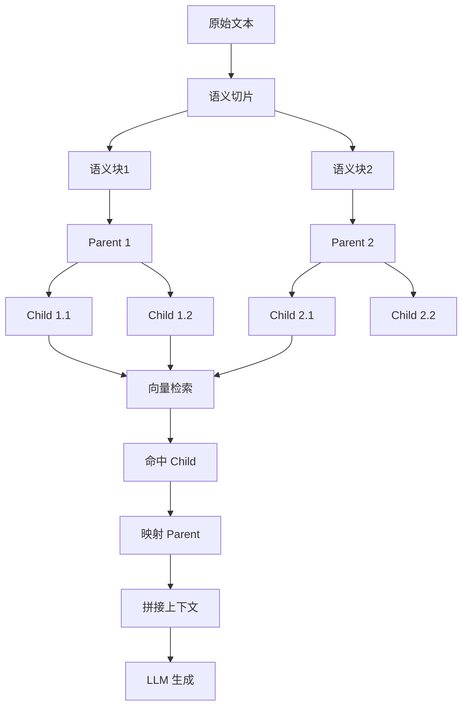
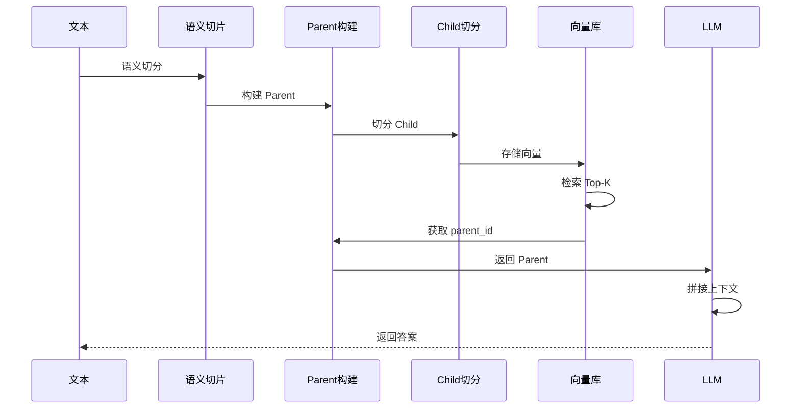

# Hybrid Chunking（语义 + 父子分块）

## 1. 背景

在 RAG 系统中，分块策略本质是在解决一个核心矛盾：

> 如何同时保证「检索精准」和「上下文完整」

这是所有大模型检索系统（包括 Google、OpenAI 内部 RAG 系统）都会遇到的问题。

### 常见两种方案

#### 1️⃣ 固定分块（Parent-Child）

优点：

- 结构稳定
- 易于工程实现

缺点：

- 无法感知语义边界
- 可能在句子中间截断

---

#### 2️⃣ 语义分块（Semantic Chunking）

优点：

- 保证语义完整
- 更符合人类理解方式

缺点：

- chunk 长度不稳定
- 不利于 embedding
- 难以控制上下文

---

### ❗ 核心问题

| 问题 | 影响 |
|------|------|
| chunk 太小 | 检索准，但信息不足 |
| chunk 太大 | 信息完整，但检索不准 |

---

👉 因此，大厂普遍采用：

> **Hybrid Chunking（混合切片）**

---

## 2. 设计思路（核心）

Hybrid Chunking 的本质：

> **语义驱动切分 + 工程化约束**

拆成两个阶段：

### 第一层：语义切片（Semantic）

- 按语义边界切分
- 保证内容“自然完整”

👉 类似 Google 文档索引中的段落级理解

---

### 第二层：结构化切片（Parent-Child）

- 控制 chunk 大小
- 建立层级关系

👉 类似 OpenAI Retrieval 中的 chunk + context 设计

---

### ✅ 核心原则

> 用语义决定“切哪里”，用结构决定“怎么用”

---

## 3. 架构图（核心）



---

### 🔍 图解说明（重点）

这张图对应完整的数据流：

#### Step 1：语义切片

```
原始文本 → 语义块
```

- 按“段落 / 主题”切分
- 保证 chunk 是“有意义的”

---

#### Step 2：构建 Parent

```
语义块 → Parent
```

- 每个 Parent 是“完整上下文”
- 用于最终喂给 LLM

---

#### Step 3：构建 Child

```
Parent → 多个 Child
```

- 更小粒度
- 专门用于 embedding 和检索

---

#### Step 4：检索流程

```
Child → 向量检索 → 命中 Child → 找 Parent
```

👉 关键：

- 检索用 Child（精度高）
- 生成用 Parent（信息全）

---

## 4. 执行流程（动态）



---

### 🔍 流程拆解

#### 阶段 1：离线处理

- 文本 → 语义切片
- 构建 Parent
- 切分 Child
- 存入向量库

---

#### 阶段 2：在线查询

1. 用户提问
2. 用 embedding 检索 Child
3. 获取对应 Parent
4. 拼接上下文
5. 输入 LLM

---

👉 这就是典型的：

> **Retriever → Reader 架构（Google 提出）**

---

## 5. 数据结构设计

### Parent

```json
{
  "parent_id": "uuid",
  "text": "语义完整块"
}
```

### Child

```json
{
  "chunk": "子块",
  "parent_id": "uuid"
}
```

---

### 🔑 设计关键点

- Child：用于检索（Vector DB）
- Parent：用于生成（LLM 输入）
- parent_id：建立关联

---

## 6. 核心实现
# 项目文件:core/chunking/hybrid_chunking.py
```python
import uuid
from typing import List, Tuple
from semantic_chunker import SemanticChunker
from sliding_window import sliding_window_chunk


class HybridChunker:

    def __init__(
        self,
        semantic_threshold=0.75,
        parent_chunk_size=1200,
        parent_overlap=200,
        child_chunk_size=300,
        child_overlap=50
    ):
        self.semantic_chunker = SemanticChunker(
            similarity_threshold=semantic_threshold
        )

        self.parent_chunk_size = parent_chunk_size
        self.parent_overlap = parent_overlap
        self.child_chunk_size = child_chunk_size
        self.child_overlap = child_overlap

    def build(self, text: str) -> Tuple[List[dict], List[dict]]:
        parents = []
        children = []

        # Step 1：语义切片
        semantic_chunks = self.semantic_chunker.chunk(text)

        # Step 2：构建 Parent + Child
        for chunk in semantic_chunks:

            parent_chunks = sliding_window_chunk(
                chunk,
                chunk_size=self.parent_chunk_size,
                overlap=self.parent_overlap
            )

            for parent_text in parent_chunks:
                parent_id = str(uuid.uuid4())

                parents.append({
                    "parent_id": parent_id,
                    "text": parent_text
                })

                child_chunks = sliding_window_chunk(
                    parent_text,
                    chunk_size=self.child_chunk_size,
                    overlap=self.child_overlap
                )

                for child_text in child_chunks:
                    children.append({
                        "chunk": child_text,
                        "parent_id": parent_id
                    })

        return parents, children
```

---

## 7. 为什么这是大厂方案？

### Google（Retriever-Reader）

- Retriever：负责召回（类似 Child）
- Reader：负责理解（类似 Parent）

---

### OpenAI（Embedding + Context）

- embedding → 小块
- context → 大块拼接

---

### Anthropic（长上下文优化）

- 强调 chunk 语义完整
- 控制 token 上限

---

👉 Hybrid = 三者融合

---

## 8. 参数设计（经验值）

| 参数 | 建议值 | 作用 |
|------|--------|------|
| semantic_threshold | 0.7 ~ 0.8 | 控制语义切分 |
| parent_chunk_size | 800 ~ 1500 | 控制上下文 |
| child_chunk_size | 200 ~ 400 | 控制检索精度 |
| overlap | 10% ~ 20% | 防止语义断裂 |

---

## 9. 实战建议

- Vector DB：只存 Child
- Parent：放 Redis / 文件系统
- 检索后去重 parent_id
- 控制最终 token（避免超长）

---

## 10. 小结

Hybrid Chunking 本质：

> **用语义解决理解问题，用结构解决工程问题**

---

## 11. 一句话总结

> Hybrid = 用语义决定“切哪里”，用结构决定“怎么用”