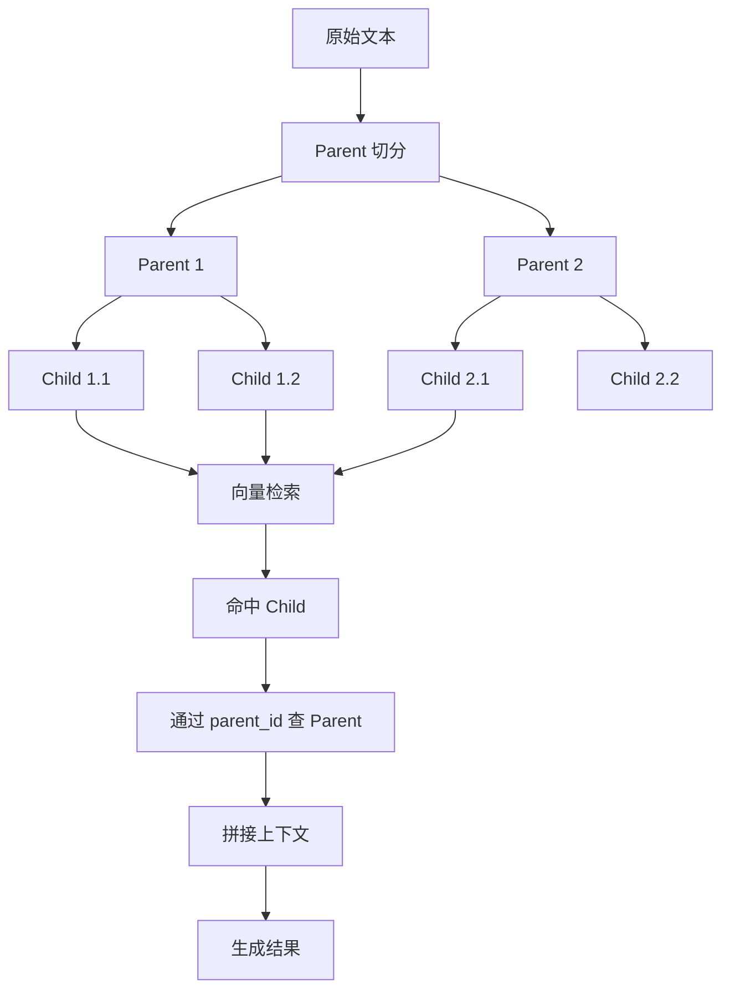
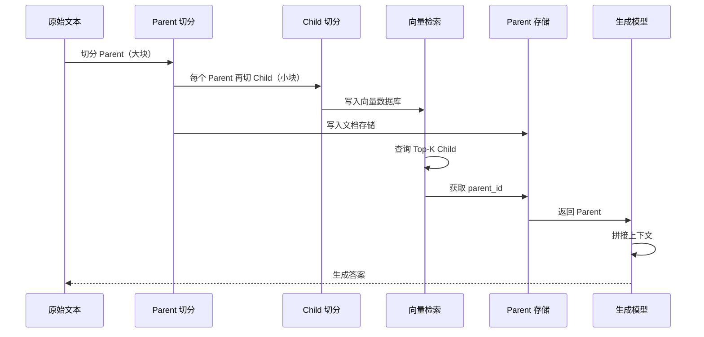
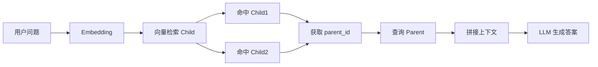

# Parent-Child 分块策略（RAG 实践）

## 1. 背景

在 RAG 系统中，分块策略会直接影响两件事：

- 检索是否准确
- 生成是否完整

常见问题：

- 分块太小：检索准，但上下文不够，LLM 无法理解完整语义
- 分块太大：上下文完整，但 embedding 表达能力下降，检索精度变差

需要在两者之间做权衡。

---

## 2. 设计思路

采用分层结构：

- Child（子块）：用于向量检索
- Parent（父块）：用于提供上下文

核心原则：

> 用小块找到内容，用大块交给模型生成

---

## 3. 结构示意（静态）



---

## 4. 执行流程（动态）



---

## 5. 数据结构

### Parent

```json
{
  "parent_id": "uuid",
  "text": "完整文本块"
}
```

### Child

```json
{
  "chunk": "子块内容",
  "parent_id": "uuid"
}
```

关键点：

- Child 存入向量数据库
- Parent 存入文档存储
- 通过 parent_id 建立关联

---

## 6. 核心实现

### 6.1 构建父子块

```python
import uuid
from core.chunking.sliding_window import sliding_window_chunk


def build_hierarchical_chunks(
    text,
    parent_chunk_size=1200,
    parent_overlap=200,
    child_chunk_size=300,
    child_overlap=50
):
    parents = []
    children = []

    # 1. 切 Parent
    parent_chunks = sliding_window_chunk(
        text,
        chunk_size=parent_chunk_size,
        overlap=parent_overlap
    )

    # 2. 每个 Parent 再切 Child
    for parent_text in parent_chunks:
        parent_id = str(uuid.uuid4())

        parents.append({
            "parent_id": parent_id,
            "text": parent_text
        })

        child_chunks = sliding_window_chunk(
            parent_text,
            chunk_size=child_chunk_size,
            overlap=child_overlap
        )

        for child_text in child_chunks:
            children.append({
                "chunk": child_text,
                "parent_id": parent_id
            })

    return parents, children
```

---

### 6.2 滑动窗口切片

```python
def sliding_window_chunk(text, chunk_size=300, overlap=50):
    chunks = []
    start = 0
    text_length = len(text)

    while start < text_length:
        end = start + chunk_size
        chunk = text[start:end]
        chunks.append(chunk)

        # 滑动窗口
        start += chunk_size - overlap

    return chunks
```

---

## 7. 切片方式说明

```
原始文本：

[-------------------------]

chunk_size = 300
overlap = 50

切分结果：

[------1------]
       [------2------]
              [------3------]
```

说明：

- 每个块之间存在重叠
- 避免语义断裂
- 提高 embedding 连续性

---

## 8. 检索流程（工程视角）



执行步骤：

1. Query → embedding
2. 向量检索 Top-K Child
3. 提取 parent_id（去重）
4. 查询 Parent
5. 拼接上下文
6. 输入 LLM 生成结果

---

## 9. 参数建议

| 参数                | 建议值        | 说明 |
|----------------- | ---------- | ---- |
| parent_chunk_size | 800 ~ 1500 | 保证上下文完整 |
| child_chunk_size  | 200 ~ 400  | 提高检索精度 |
| overlap           | 10% ~ 20%  | 防止语义断裂 |

---

## 10. 常见问题

### 1. 为什么不直接用大块？

embedding 精度下降，检索不准确。

---

### 2. 为什么不只用小块？

上下文不完整，LLM 容易答非所问。

---

### 3. overlap 有必要吗？

有。

可以避免句子截断，提高语义连续性。

---

### 4. 为什么需要 parent_id？

用于在检索阶段从 Child 映射回 Parent。

---

## 11. 小结

- Child → 提高检索精度
- Parent → 保证生成质量

本质是：

> 将“检索”和“生成”解耦

适用于：

- 长文档
- 企业知识库
- RAG 系统