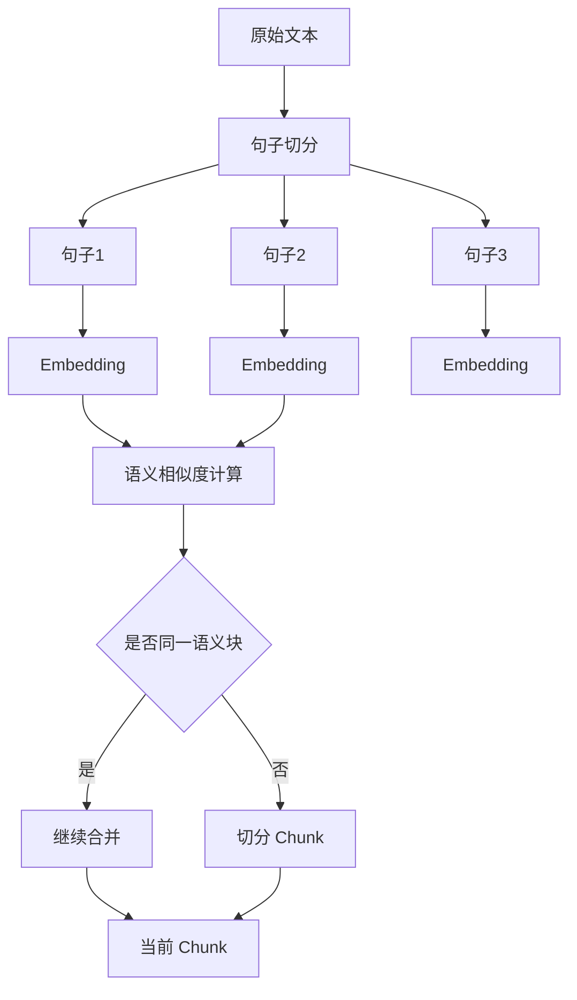
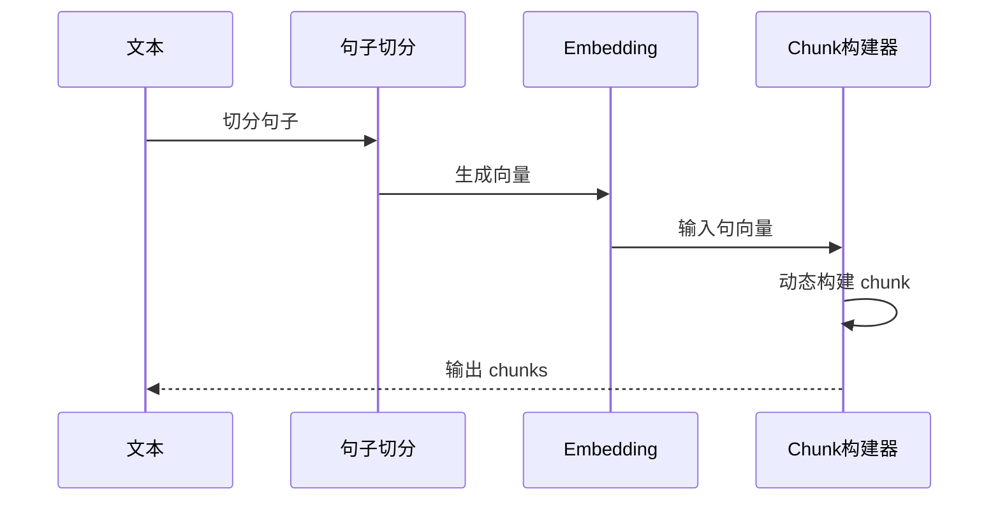

# 语义切片策略

## 1. 背景

在 RAG 系统中，固定长度切片存在一个核心问题：

- 无法保证语义完整
- 容易在句子/段落中间断开

这会导致：

- embedding 表达不准确
- 检索命中率下降

---

## 2. 设计思路

语义切片的核心思想：

> 根据“语义变化”来决定切片位置，而不是固定长度

基本策略：

- 先按句子切分
- 计算语义相似度
- 根据“语义连续性”动态构建 chunk

---

## 3. 结构示意



---

## 🔍 图解核心理解（重点）

这张图本质在做一件事：

> 判断“当前句子”是否还能属于“当前语义块”

---

## 4. 执行流程（动态）



---

## 🔍 工程视角（关键）

整个过程是一个“流式构建”：

```
current_chunk = 正在构建的块
chunks = 已完成的块
```

流程：

```
不断尝试把新句子加入 current_chunk
如果不合适 → 提交 current_chunk，开启新块
```

---

## 5. 核心实现

- ✅ 使用 **chunk整体语义**（不是前一句）
- ✅ 加入 **min_chunk_size 控制**
- ✅ 避免语义抖动
- ✅ 更接近真实生产逻辑

---

### 代码实现

```python
import numpy as np
from sentence_transformers import SentenceTransformer
import re


class SemanticChunker:
    def __init__(
        self,
        model_name="BAAI/bge-small-zh",
        similarity_threshold=0.75,
        max_chunk_size=500,
        min_chunk_size=100
    ):
        self.model = SentenceTransformer(model_name)
        self.similarity_threshold = similarity_threshold
        self.max_chunk_size = max_chunk_size
        self.min_chunk_size = min_chunk_size

    def split_sentences(self, text):
        sentences = re.split(r'[。！？\n]', text)
        return [s.strip() for s in sentences if s.strip()]

    def compute_similarity(self, vec1, vec2):
        return np.dot(vec1, vec2) / (
            np.linalg.norm(vec1) * np.linalg.norm(vec2)
        )

    def chunk(self, text):
        sentences = self.split_sentences(text)

        if not sentences:
            return []

        embeddings = self.model.encode(sentences)

        chunks = []
        current_chunk = [sentences[0]]
        start = 0  # 当前chunk起点

        for i in range(1, len(sentences)):

            current_text = "".join(current_chunk)

            # ✅ 用整个chunk语义
            chunk_vec = np.mean(embeddings[start:i], axis=0)

            sim = self.compute_similarity(
                chunk_vec,
                embeddings[i]
            )

            # ✅ 切分条件
            if (
                (sim < self.similarity_threshold and len(current_text) > self.min_chunk_size)
                or len(current_text) > self.max_chunk_size
            ):
                chunks.append(current_text)

                current_chunk = [sentences[i]]
                start = i
            else:
                current_chunk.append(sentences[i])

        if current_chunk:
            chunks.append("".join(current_chunk))

        return chunks
```

---

## 6. 核心流程拆解（逐行理解）

### Step 1：初始化

```
current_chunk = [句1]
start = 0
```

---

### Step 2：循环处理每个句子

```
for i in range(1, len(sentences))
```

👉 从第二个句子开始

---

### Step 3：计算当前 chunk 的语义

```
chunk_vec = mean(embeddings[start:i])
```

👉 不是“前一句”，而是：

> 当前整个 chunk 的语义中心

---

### Step 4：判断是否切分

```
sim < threshold
```

👉 表示：

> 当前句子“语义偏离”当前 chunk

---

### Step 5：触发切分

```
chunks.append(current_text)
current_chunk = [新句子]
```

👉 关键动作：

- 保存旧 chunk
- 开新 chunk

---

## 7. 示例推演（最重要）

### 输入文本：

```
今天天气很好。
适合出去散步。
股票市场出现波动。
投资者情绪紧张。
```

---

### 相似度：

```
句1-句2 = 0.92 ✅
句2-句3 = 0.30 ❌
句3-句4 = 0.88 ✅
```

---

### 执行过程：

#### 第一步：

```
current_chunk = [句1]
```

---

#### 第二步（句2）：

```
相似 → 合并
```

```
current_chunk = [句1, 句2]
```

---

#### 第三步（句3）：

```
不相似 → 切分
```

```
chunks = ["句1+句2"]
current_chunk = [句3]
```

---

#### 第四步（句4）：

```
相似 → 合并
```

```
current_chunk = [句3, 句4]
```

---

### 最终结果：

```
[
  "句1 + 句2",
  "句3 + 句4"
]
```

---

## 8. 本质理解（非常重要）

语义切片不是：

> ❌ 找“断点”

而是：

> ✅ 维护“语义连续区域”

---

## 9. 参数建议

| 参数 | 建议值 | 说明 |
|------|--------|------|
| similarity_threshold | 0.7 ~ 0.85 | 控制语义敏感度 |
| max_chunk_size | 400 ~ 800 | 控制上限 |
| min_chunk_size | 100 ~ 200 | 防止碎片 |

---

## 10. 常见问题（进阶）

### Q1：为什么不用“前一句”？

因为：

- 前一句不稳定
- 容易被噪声影响

👉 企业做法：

> 用 chunk 整体语义

---

### Q2：为什么要 min_chunk_size？

防止：

- chunk 太碎
- embedding 噪声大

---

### Q3：语义切片能直接用于RAG吗？

不推荐：

- chunk 不稳定
- 上下文不可控

👉 正确做法：

```
语义切片 + Parent-Child
```

---

## 11. 小结

语义切片的本质是：

> 用 embedding 来“理解文本结构”

---

## 12. 一句话总结

> 语义切片 = 用“语义连续性”动态构建 chunk，而不是按长度切