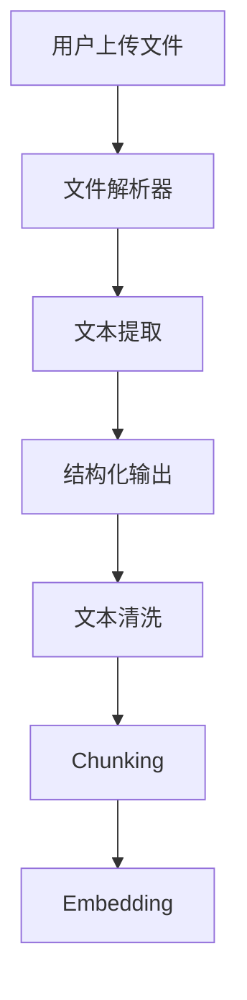

# 文件解析概述（RAG 系统中的文件处理）

## 1. 背景

RAG 系统的核心步骤之一就是从用户上传的文件中提取可用的信息。由于用户上传的文件格式多样，我们需要针对不同文件类型提供相应的解析方式。

常见文件类型包括：

- 文本文件（.txt）
- Word 文件（.docx）
- PDF 文件（.pdf）
- PowerPoint 文件（.pptx）
- Markdown 文件（.md）

---

## 2. 文件解析的重要性

文件解析不仅仅是提取文本，更是 RAG 系统的“质量控制”环节。文件解析的质量直接影响后续：

- **文本清洗和预处理：** 准确解析保证后续的有效数据输入。
- **数据结构化：** 解析过程将不同格式的文件转化为统一的结构。

---

## 3. 解析流程（从文件到文本）



---

## 🔍 图解说明

### Step 1：用户上传文件

用户上传各种文件类型：

```
PDF / Word / PPT / Markdown / TXT
```

---

### Step 2：解析器对文件类型进行解析

- **PDF**：需要先提取文本
- **Word**：提取段落和文本
- **PPT**：提取每页内容
- **Markdown**：直接提取
- **TXT**：读取纯文本

---

### Step 3：文本清洗

将提取出的文本进行清洗，去除特殊字符、空格等。

---

### Step 4：输入到 RAG 系统

经过处理后的文本进入下游流程，包括 **Chunking** 和 **Embedding**。

---

## 4. 关键技术（工具和技术栈）

企业级文件解析的核心技术和工具：

- **PDF 解析**：使用 **PyMuPDF** 或 **pdfplumber**
- **Word 解析**：使用 **python-docx**
- **PPT 解析**：使用 **python-pptx**
- **Markdown 解析**：使用 **markdown**
- **OCR（扫描 PDF）**：使用 **Tesseract** 或 **PaddleOCR**

---

## 5. 总结

文件解析是 RAG 系统的基础，它将不同来源、不同格式的文件转化为统一的文本格式，保证后续的文本处理和查询高效可靠。
