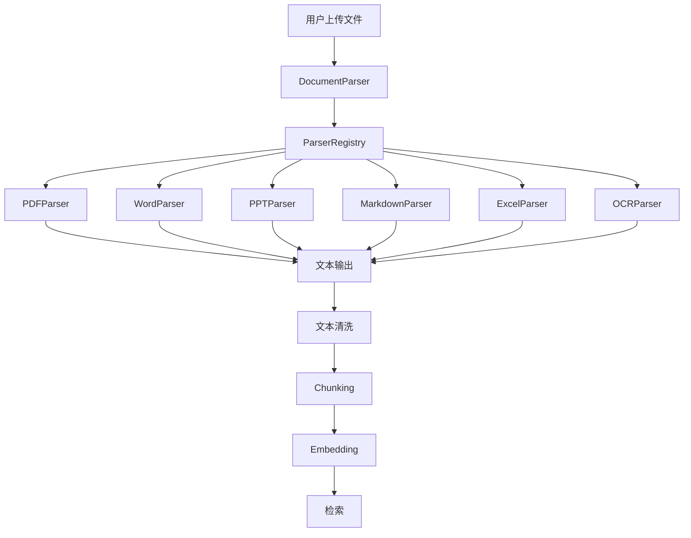

# 多模态文件解析系统（基于 LangChain 1.x）

## 1. 背景

在 RAG 系统中，用户上传的文件格式可能非常多样化，例如 `.pdf`, `.docx`, `.pptx`, `.md`, `.xlsx` 等。为了能够在后续的 RAG 流程中处理这些文件，必须先将文件内容提取为文本格式，这一步是非常关键的。

如果每次都手动判断文件类型并进行不同的处理，不仅代码复杂且难以维护，而且随着文件格式增多，系统的扩展性将会受到极大的限制。因此，我们需要一种灵活的解决方案。

### **LangChain** 作为文档处理的核心框架，能提供强大的文档加载器（Document Loaders），它支持从不同文件类型中加载并解析文本数据。本文将基于 **LangChain 1.x** 版本，展示如何高效地解析多模态文件，并集成到 RAG 流程中。

---

## 2. 系统架构



---

## 3. 系统流程解析

### Step 1：用户上传文件

用户上传不同格式的文件，例如：

```
contract.pdf
slides.pptx
report.docx
sales.xlsx
notes.md
```

 **问题**：这些文件不是“纯文本”，系统无法直接进行处理。

---

### Step 2：DocumentParser 作为统一入口

文件上传后，`DocumentParser` 作为统一的文件解析入口，根据文件的后缀（例如 `.pdf`, `.docx`, `.pptx`）通过解析器注册中心（`ParserRegistry`）自动选择对应的解析器。

 **解析器注册中心（ParserRegistry）**：是一个路由系统，将文件后缀与解析器（如 `PDFParser`, `WordParser` 等）映射起来。解析器会根据文件类型自动执行相应的处理操作。

---

### Step 3：通过注册中心获取解析器

```python
import os

class DocumentParser:

    def __init__(self):
        self.registry = ParserRegistry()

        # 注册解析器
        self.registry.register(".pdf", PDFParser())
        self.registry.register(".docx", WordParser())
        self.registry.register(".pptx", PPTParser())
        self.registry.register(".md", MarkdownParser())
        self.registry.register(".xlsx", ExcelParser())
        self.registry.register(".jpg", OCRParser())  # OCR解析（对于扫描版PDF或图片）

    def parse(self, file_path):
        ext = os.path.splitext(file_path)[-1].lower()

        parser = self.registry.get_parser(ext)

        text = parser.parse(file_path)

        return {"text": text, "source": file_path}
```

---

### Step 4：各类解析器处理不同格式文件

每种解析器独立处理对应的文件格式，解析文件内容为**统一文本格式**。

---

####  PDF 解析器（包含 OCR 解析扫描文件）

```python
# core/parser/pdf_parser.py

import fitz  # PyMuPDF
import pytesseract
from PIL import Image
from .base import BaseParser


class PDFParser(BaseParser):

    def parse(self, file_path: str) -> str:
        doc = fitz.open(file_path)
        texts = []

        for page in doc:
            text = page.get_text()

            if not text.strip():  # 如果是扫描版PDF，使用OCR
                text = self._ocr_page(page)

            texts.append(text)

        return "\n".join(texts)

    def _ocr_page(self, page):
        pix = page.get_pixmap()
        img = Image.frombytes("RGB", [pix.width, pix.height], pix.samples)
        return pytesseract.image_to_string(img)
```

---

####  Word 解析器

```python
# core/parser/word_parser.py

from docx import Document
from .base import BaseParser


class WordParser(BaseParser):

    def parse(self, file_path: str) -> str:
        doc = Document(file_path)
        texts = [p.text for p in doc.paragraphs if p.text.strip()]
        return "\n".join(texts)
```

---

####  PPT 解析器

```python
# core/parser/ppt_parser.py

from pptx import Presentation
from .base import BaseParser


class PPTParser(BaseParser):

    def parse(self, file_path: str) -> str:
        prs = Presentation(file_path)
        texts = []

        for slide in prs.slides:
            for shape in slide.shapes:
                if hasattr(shape, "text"):
                    texts.append(shape.text)

        return "\n".join(texts)
```

---

####  Excel 解析器

```python
# core/parser/excel_parser.py

import pandas as pd
from .base import BaseParser


class ExcelParser(BaseParser):

    def parse(self, file_path: str) -> str:
        df = pd.read_excel(file_path)
        return df.to_string(index=False)
```

---

####  Markdown 解析器

```python
# core/parser/markdown_parser.py

from .base import BaseParser


class MarkdownParser(BaseParser):

    def parse(self, file_path: str) -> str:
        with open(file_path, "r", encoding="utf-8") as f:
            return f.read()
```

---

### Step 5：返回统一文本格式

所有解析器会返回**统一的文本格式**，并包含文件源信息：

```json
{
  "text": "...",   # 解析后的文本
  "source": "xxx.pdf"  # 文件来源
}
```

---

### Step 6：文本清洗和处理

文本清洗包括：

- 去除无关字符
- 处理换行、标点等问题
- 统一文本格式，保证后续的 chunking、embedding 不会受到影响

---

### Step 7：文本切片与嵌入（进入 RAG 流程）

解析后的文本会进入 **chunking** 阶段：

- **Chunking**：将文本按逻辑块进行切分，通常基于段落、句子等语义边界。
- **Embedding**：将文本切片转换为向量，供后续的检索使用。

---

## 4. 核心代码实现（闭环）

```python
class DocumentParser:

    def __init__(self):
        self.registry = ParserRegistry()

        # 注册各类解析器
        self.registry.register(".pdf", PDFParser())
        self.registry.register(".docx", WordParser())
        self.registry.register(".pptx", PPTParser())
        self.registry.register(".md", MarkdownParser())
        self.registry.register(".xlsx", ExcelParser())

    def parse(self, file_path):
        ext = os.path.splitext(file_path)[-1].lower()

        parser = self.registry.get_parser(ext)

        text = parser.parse(file_path)

        return {"text": text, "source": file_path}
```

---

## 5. ParserRegistry（解析器注册中心）

`ParserRegistry` 是负责管理所有文件类型和解析器的“路由系统”。

```python
# core/parser/registry.py

class ParserRegistry:

    def __init__(self):
        self._parsers = {}

    def register(self, ext: str, parser):
        """注册解析器"""
        self._parsers[ext.lower()] = parser

    def get_parser(self, ext: str):
        """根据文件扩展名获取解析器"""
        if ext.lower() not in self._parsers:
            raise ValueError(f"Unsupported file type: {ext}")
        return self._parsers[ext.lower()]
```

---

## 6. 集成 LangChain 1.x（与 RAG 流程结合）

### 使用 LangChain 1.x 加载文件并转换为文本

LangChain 提供了强大的 **DocumentLoader** 功能，用于从文件中加载数据并转换为统一的文本格式。通过 **PyPDFLoader**、**DocxLoader** 等类，我们可以从不同的文件格式中提取文本。

```python
from langchain.document_loaders import PyPDFLoader, DocxLoader, PPTXLoader, MarkdownLoader

loaders = {
    ".pdf": PyPDFLoader,
    ".docx": DocxLoader,
    ".pptx": PPTXLoader,
    ".md": MarkdownLoader,
    ".xlsx": ExcelParser  # 这里可以直接集成之前实现的 ExcelParser
}

def load_document(file_path: str):
    ext = os.path.splitext(file_path)[-1].lower()
    loader = loaders.get(ext)
    if not loader:
        raise ValueError(f"Unsupported file type: {ext}")
    return loader(file_path).load()
```

---

## 7. 优化实践

### 1. **LangChain** 实践

在 LangChain 1.x 中，处理文件的思路类似：

```python
from langchain.document_loaders import PyPDFLoader, DocxLoader, PPTXLoader, MarkdownLoader

loaders = {
    ".pdf": PyPDFLoader,
    ".docx": DocxLoader,
    ".pptx": PPTXLoader,
    ".md": MarkdownLoader,
}

def load_document(file_path: str):
    ext = os.path.splitext(file_path)[-1].lower()
    loader = loaders.get(ext)
    if not loader:
        raise ValueError(f"Unsupported file type: {ext}")
    return loader(file_path).load()
```

