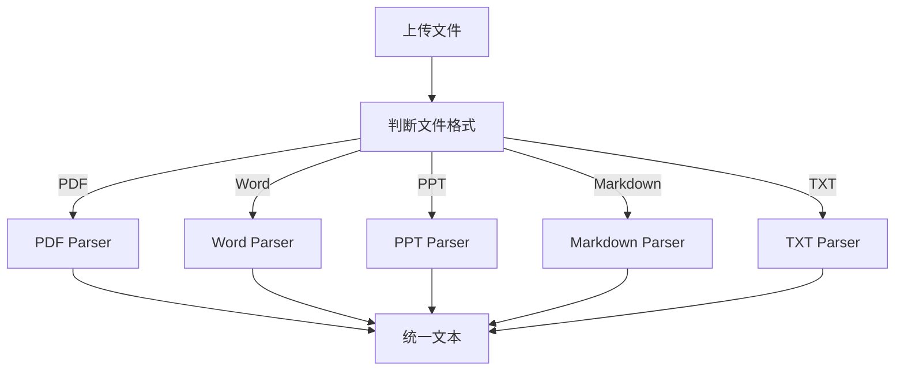

# 支持的文件格式（企业级设计）

## 1. 背景

在 RAG 系统中，我们需要支持多种文件格式。不同格式的文件有不同的解析方式。我们要确保系统能有效地解析常见的文件格式，并能从中提取出有效的数据。

---

## 2. 支持的文件格式

以下是当前支持的文件格式及对应解析方法：

| 文件格式     | 后缀        | 解析方法                 | 复杂度 |
|--------------|-------------|--------------------------|--------|
| PDF          | .pdf        | PyMuPDF / PDFplumber / OCR | ⭐⭐⭐⭐ |
| Word         | .docx       | python-docx               | ⭐⭐    |
| PowerPoint   | .pptx       | python-pptx               | ⭐⭐⭐   |
| Markdown     | .md         | markdown → HTML           | ⭐⭐    |
| Plain Text   | .txt        | 直接读取                 | ⭐     |

---

## 3. 解析流程（不同格式不同解析）



---

### Step 1：判断文件格式

根据上传的文件后缀，选择合适的解析器。

- **PDF**：使用 PyMuPDF 或 pdfplumber，或者在图像扫描时使用 OCR 技术。
- **Word**：使用 python-docx 库解析内容。
- **PPT**：使用 python-pptx 解析。
- **Markdown**：使用 Markdown 转换为 HTML，再提取文本。
- **TXT**：直接读取文本内容。

---

### Step 2：调用对应的解析器

根据文件格式，分别调用对应的解析器，将文件中的内容提取出来。

---

### Step 3：统一输出文本

所有文件解析的输出格式保持一致：

```json
{
  "text": "提取的文本内容",
  "source": "原始文件路径"
}
```

---

## 4. 常见问题

### 1. 为什么不能统一用一个解析器？

不同文件格式的内容组织方式完全不同：

- **PDF** 是图像或结构化文本；
- **Word** 有明确的段落结构；
- **PPT** 则是按页面进行划分的。

这些结构差异要求我们使用不同的解析方法。

---

### 2. 未来要支持哪些文件格式？

我们可以继续扩展：

- **Excel**：可以通过 **openpyxl** 或 **pandas** 处理。
- **图像**：通过 OCR 提取图像中的文本。

---

## 5. 一句话总结

> 文件解析必须因文件格式而异，采用不同的解析策略以确保精确性。